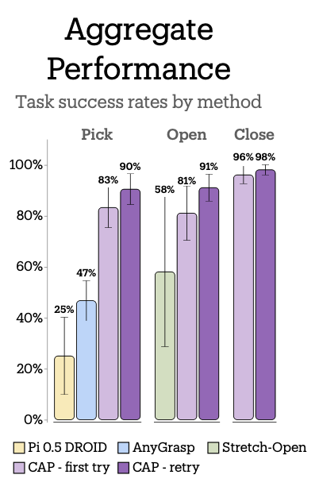
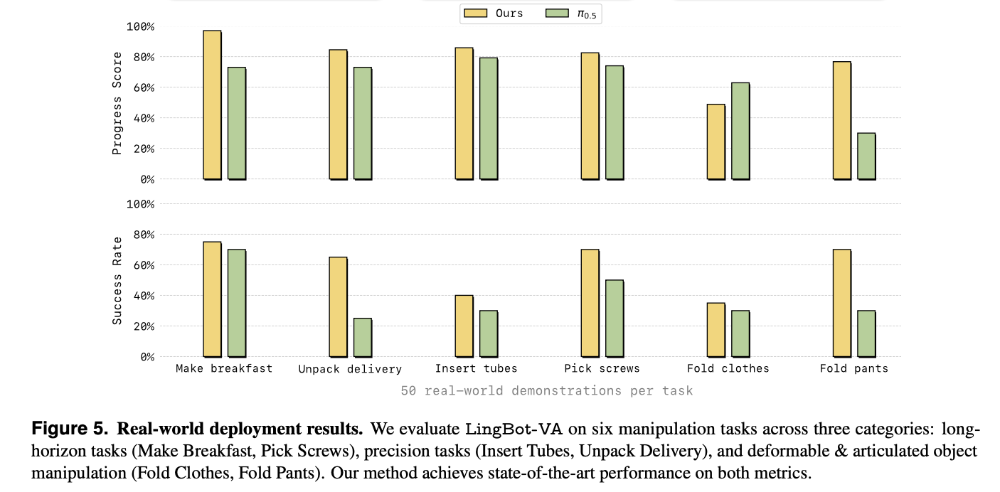
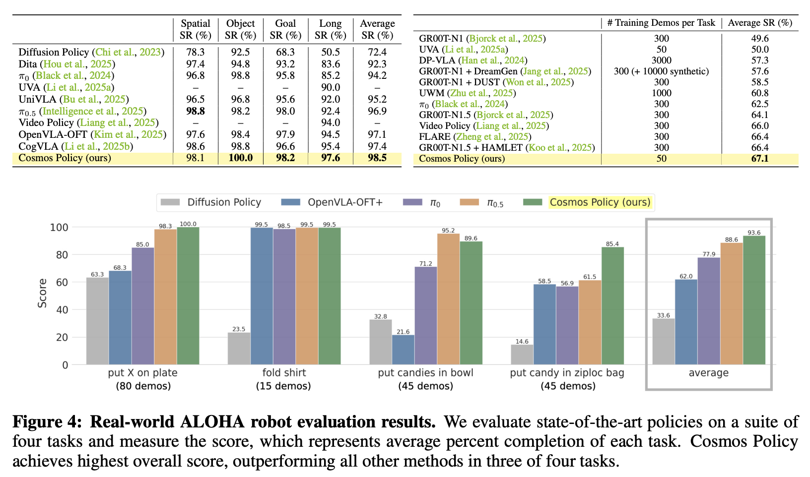
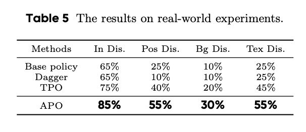
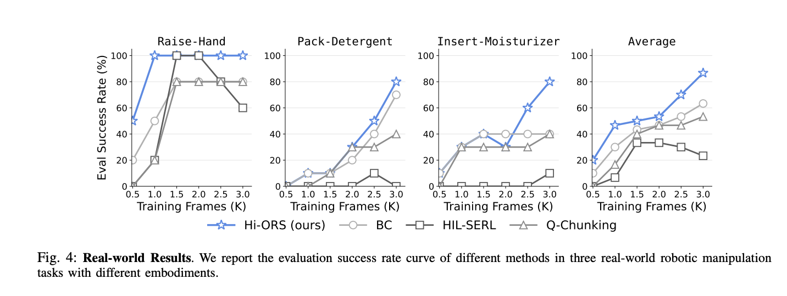
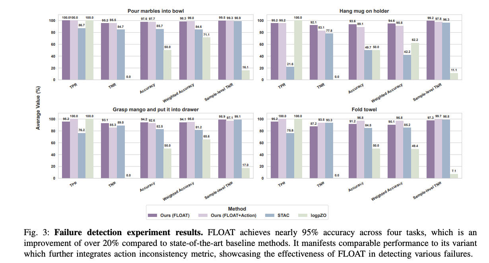

# Awesome Reliable Robotics 🤖

A curated collection of robotics papers focused on real-world reliability and robustness. 
Originally a personal reference, I’m sharing this list in hopes it helps others.

Prerequisite: must include real-world results.

Contributions are welcome!

---
| **Name** | **Date** | **Categories** | **Real World Success Rate** |**Project** | **Paper** | **Code** |  **Organization(s)** | **Notes** |
| --- | --- | --- | --- | --- | --- | --- | --- | --- |
| Contact-Anchored Policies: Contact Conditioning Creates Strong Robot Utility Models | 02/2026 | `Representation Learning` | Average zero-shot success with Picking, Opening, and Closing tasks across 4 robot arms shown below.  | <a href="https://cap-policy.github.io/" target="_blank">Project</a> | <a href="https://arxiv.org/abs/2501.05936" target="_blank">Paper</a> | <a href="https://github.com/jeffacce/cap-policy" target="_blank">Code</a> | NYU, UC Berkeley, UCLA, Hello Robot, Ai2, University of Waterloo | Replaces language conditioning with physical contact points. Uses VQ-BeT architecture with contact anchors. Trained on handheld gripper data, generalizes zero-shot to multiple robot embodiments. |
| LingBot-VA: Causal World Modeling for Robot Control | 01/2026 | `World Models` | Real-world Success Rate (SR) / Progress Score (PS): Make Breakfast **75% SR/97% PS**, Pick Screws **70% SR/82.5% PS**, Fold Clothes **35% SR/48.8% PS**, Unpack Delivery **65% SR/84.5% PS**, Insert Tubes **40% SR/85.8% PS**, Fold Pants **70% SR/76.7% PS**. Achieves **>20%** improvement over π0.5 on challenging tasks with only 50 demos. | <a href="https://technology.robbyant.com/lingbot-va" target="_blank">Project</a> | <a href="https://github.com/Robbyant/lingbot-va/blob/main/LingBot_VA_paper.pdf" target="_blank">Paper</a> | <a href="https://github.com/robbyant/lingbot-va" target="_blank">Code</a> | Ant Group/Alibaba |  A powerful autoregressive diffusion framework (5.3B params) that predicts both video movement and actions together via Mixture-of-Transformers architecture. It efficiently plans ahead, learns quickly from data, and handles new situations well. Great at complex, long-term tasks.
| Cosmos Policy: Fine-Tuning Video Models for Visuomotor Control and Planning | 01/2026 | `World Models` | **93.6%** average success on challenging real-world ALOHA bimanual manipulation tasks.  With model-based planning, achieves **12.5%** higher task completion rate on challenging real-world tasks. | <a href="https://research.nvidia.com/labs/dir/cosmos-policy/" target="_blank">Project</a> | <a href="https://arxiv.org/abs/2601.16163" target="_blank">Paper</a> | <a href="https://github.com/nvlabs/cosmos-policy" target="_blank">Code</a> | NVIDIA, Stanford University | Single-stage fine-tuning of pretrained video model (Cosmos-Predict2-2B) that generates robot actions, future states, and values as latent frames. Uses model-based planning with best-of-N sampling to achieve higher success rates. Can learn from policy rollout data to refine world model and value function. |
| Does learning from experience benefit small AI robotics models?   | 12/2025 | `Imitation Learning` | 4/5 when training simple ACT on imitation + corrections only. | <a href="https://villekuosmanen.medium.com/does-learning-from-experience-benefit-small-ai-robotics-models-3de024f930e0" target="_blank">Article</a> | | | | Replicating the RL loop behind Physical Intelligence's Pi*0.6 foundation model without VLAs or diffusion. |
|π*0.6 : a VLA That Learns From Experience| 11/2025 | `VLA`|The system ran for 13 hours straight making espresso drinks and over two hours folding novel laundry items without interruptions.  Success Rates: Laundry (t-shirts & shorts) **~95%**, Laundry (Diverse Hardest Items) **~70%**, Make Espresso **~90%**, Box Assembly **~90%** | <a href="https://www.pi.website/blog/pistar06" target="_blank">Project</a> | <a href="https://www.pi.website/download/pistar06.pdf" target="_blank">Paper</a> | | Physical Intelligence |  RECAP is an iterated offline RL framework that improves a Vision-Language-Action (VLA) model ($\pi^* 0.6$) by conditioning it on advantage estimates derived from a value function, allowing the model to learn and self-correct from real-world data like demonstrations, autonomous experience, and human interventions.
| RL-100: Performant Robotic Manipulation with Real-World Reinforcement Learning | 10/2025 | `Online RL`| **100%**  success across 7 tasks. **92.5%** average zero-shot success on 3 tasks (without any retraining or fine-tuning), **86.7%** average few-shot success on 3 tasks  | <a href="https://lei-kun.github.io/RL-100/" target="_blank">Project</a> | <a href="https://arxiv.org/abs/2510.14830" target="_blank">Paper</a> | | Shanghai Qizi, Shanghai Jiao Tong, HKU, UNC Chapel Hill |  code to be released "after paper is accepted"
| APO: Human-assisted Robotic Policy Refinement via Action Preference Optimization | 10/2025 | `Human-in-the-loop`| Improvement on success rates of Dagger, TPO, etc on in-distribution, as well as when position, background, or texture are disrupted.    | <a href="https://gewu-lab.github.io/action_preference_optimization/" target="_blank">Project</a> | <a href="https://arxiv.org/pdf/2506.07127" target="_blank">Paper</a> | <a href="https://github.com/GeWu-Lab/Action-Preference-Optimization" target="_blank">Code</a> | ByteDance |
| HI-ORS: Human-in-the-loop Online Rejection Sampling for Robotic Manipulation | 10/2025 | `Human-in-the-loop`| Improved RW Success Rates vs vanilla BC, HIL-SERL, Q-Chunking.  | <a href="https://hiors-project.github.io/" target="_blank">Project</a> | <a href="https://arxiv.org/pdf/2510.26406" target="_blank">Paper</a> | <a href="https://github.com/hiors-project/hiors" target="_blank">Code</a> | TenCent |  |
| ARMADA/FLOAT: Autonomous Online Failure Detection and Human Shared Control Empower Scalable Real-world Deployment and Adaptation | 10/2025 || failure detector FLOAT achieves nearly **95%** accuracy on average, surpassing prior SOTA failure detection approaches by > 20%.  | <a href="https://virlus.github.io/armada/" target="_blank">Project</a> | <a href="https://arxiv.org/abs/2510.02298" target="_blank">Paper</a> | <a href="https://github.com/Virlus/armada" target="_blank">Code</a> | Shanghai Jiao Tong University |  |
| SARM: Stage-Aware Reward Modeling for Long Horizon Robot Manipulation | 09/2025 | `Rewards`| **83%** success on folding T-shirts (flattened), **67%** success on folding T-shirts (crumpled). Surpasses vanilla BC (8% and 0%). | <a href="https://qianzhong-chen.github.io/sarm.github.io/" target="_blank">Project</a> | <a href="https://arxiv.org/abs/2509.25358" target="_blank">Paper</a> | [Code in LeRobot](https://huggingface.co/docs/lerobot/sarm) | Stanford, UC Berkeley, xdof.ai | Video-based reward modeling framework that jointly predicts high-level task stages and fine-grained progress.
| Dual-Actor Fine-Tuning of VLA Models: A Talk-and-Tweak Human-in-the-Loop Approach | 09/2025 | `VLA` | **100%**  success across three tasks within 101 minutes of online fine-tuning. For long-horizon tasks, it sustains a **50%** success rate over 12 consecutive operations. | <a href="https://sites.google.com/view/hil-daft/" target="_blank">Project</a> | <a href="https://arxiv.org/pdf/2509.13774" target="_blank">Paper</a> | | Zhejiang & others |  no code : (
| WSRL: Efficient Online Reinforcement Learning Fine-Tuning Need Not Retain Offline Data | 07/2025 | `Online RL`| **100%** success rate on Franka peg insertion task in 18 minutes, SERL fails (0/20) even with 50 minutes. | <a href="https://zhouzypaul.github.io/wsrl/" target="_blank">Project</a> | <a href="https://arxiv.org/pdf/2412.07762" target="_blank">Paper</a> | <a href="https://github.com/zhouzypaul/wsrl" target="_blank">Code</a> | UC Berkeley |  Overall idea:  No data retention during fine-tuning, warmup phase with small rollouts from pre-trained policy.  Unfortunately, only 1 real world experiment, all others in sim.
| Dyna Robotics (Unknown Model) | 07/2025 || **99.9%** success rate in folding towels for 8 hours/day over 3 days (dropped 1 towel on day 2).  No intervention.  |  <a href="https://x.com/DynaRobotics/status/1940443709621109186" target="_blank">Project</a> | | | Dyna Robotics | |
| Figure (Helix) | 06/2025 || **~95%** accuracy at correctly orienting barcodes. **4.05** seconds per package. |  <a href="https://www.figure.ai/news/scaling-helix-logistics" target="_blank">Project</a> | | | Figure | Adds memory for more robust, long-term tasks and force feedback for improved grip.
| RSS 2025 Workshop: Human-in-the-Loop Robot Learning: Teaching, Correcting, and Adapting | 06/2025 || various results | <a href="https://hitl-robot-learning.github.io/" target="_blank">Project</a> |  |  | various universities | 
| Compliant Residual DAgger: Improving Real-World Contact-Rich Manipulation with Human Corrections | 06/2025 | `Human-in-the-loop`| book-flipping success rate of **100%** (**60%** improvement) and belt assembly success of **70%** (**50%** improvement)  | <a href="https://compliant-residual-dagger.github.io/" target="_blank">Project</a> | <a href="https://arxiv.org/abs/2506.16685" target="_blank">Paper</a> |  <a href="https://github.com/yifan-hou/cr-dagger" target="_blank">Code</a>| Stanford | 
| ReWiND: Language-Guided Rewards Teach Robot Policies without New Demonstrations | 05/2025 | `Rewards`| an hour of real-world RL improves success rate from 12% to 68%, vs 8% to 10% with VLC   | <a href="https://rewind-reward.github.io/" target="_blank">Project</a> | <a href="https://arxiv.org/abs/2505.10911" target="_blank">Paper</a> | <a href="https://github.com/rewind-reward/ReWiND" target="_blank">Code</a> | U Wash | 
| Dyna Robotics DYNA-1 Model | 04/2025 || **99.4%** success rate in folding napkins over 24 hours. No intervention. &nbsp;&nbsp;&nbsp;&nbsp;&nbsp;&nbsp;&nbsp;&nbsp;&nbsp;&nbsp;&nbsp;&nbsp;&nbsp;&nbsp;&nbsp;&nbsp;&nbsp;&nbsp;&nbsp;&nbsp;&nbsp;&nbsp;&nbsp;&nbsp;&nbsp;&nbsp;&nbsp;&nbsp;&nbsp;&nbsp;&nbsp;&nbsp;&nbsp;&nbsp;&nbsp;&nbsp;&nbsp;&nbsp;&nbsp;&nbsp;&nbsp;&nbsp;&nbsp;&nbsp;&nbsp;&nbsp;&nbsp;&nbsp;&nbsp;&nbsp;&nbsp;&nbsp;&nbsp;&nbsp;&nbsp;&nbsp;&nbsp;&nbsp;&nbsp;&nbsp;&nbsp;&nbsp;&nbsp;&nbsp;&nbsp;&nbsp;&nbsp;&nbsp;&nbsp;&nbsp;&nbsp;&nbsp;&nbsp;&nbsp;&nbsp;&nbsp;&nbsp;&nbsp;&nbsp;&nbsp;&nbsp;&nbsp;&nbsp;&nbsp;&nbsp;&nbsp;&nbsp;&nbsp;&nbsp;&nbsp;&nbsp;&nbsp;&nbsp;&nbsp;&nbsp;&nbsp;&nbsp;&nbsp;&nbsp;&nbsp;&nbsp;&nbsp; |  <a href="https://www.dyna.co/research)" target="_blank">Project</a> | | | Dyna Robotics | |
| ConRFT: A Reinforced Fine-tuning Method for VLA Models via Consistency Policy | 02/2025 | `VLA`| **96.3%** avg success rate across tasks, compared to 31.9% w/ HIL-SERL  | | <a href="https://arxiv.org/pdf/2502.05450" target="_blank">Paper</a> | <a href="https://github.com/cccedric/conrft" target="_blank">Code</a> | Chinese Academy of Sciences | Online and offline fine-tuning. |
| HIL-SERL: Precise and Dexterous Robotic Manipulation via Human-in-the-Loop Reinforcement Learning | 10/2024 | `Online RL`| **100%** success rate on a variety of tasks   | <a href="https://hil-serl.github.io/" target="_blank">Project</a> | <a href="https://hil-serl.github.io/static/hil-serl-paper.pdf" target="_blank">Paper</a> | <a href="https://github.com/rail-berkeley/hil-serl" target="_blank">Code</a> | UC Berkeley | Online fine-tuning, human intervention allowed.  Implementation available in LeRobot. |
| RLIF: INTERACTIVE IMITATION LEARNING AS REINFORCEMENT LEARNING | 03/2024 | `Imitation Learning`| **95%** success rate in cloth unfolding within 7 rounds, **100%** rate success in peg insertion within 6 rounds  | <a href="https://rlif-page.github.io/" target="_blank">Project</a> | <a href="https://arxiv.org/pdf/2311.12996" target="_blank">Paper</a> | <a href="https://github.com/pd-perry/RLIF" target="_blank">Code</a> | UC Berkeley |  |
| SERL: A Software Suite for Sample-Efficient Robotic Reinforcement Learning | 01/2024 | `Online RL`| **100%** success on PCB insertion, cable routing, object relocation   | <a href="https://serl-robot.github.io/" target="_blank">Project</a> | <a href="https://arxiv.org/abs/2401.16013" target="_blank">Paper</a> | <a href="https://github.com/rail-berkeley/serl" target="_blank">Code</a> | UC Berkeley | |
