

A curated collection of robotics papers focused on real-world reliability and robustness.
Originally a personal reference, I'm sharing this list in hopes it helps others.

Prerequisite: must include real-world results.

Contributions are welcome!

---
| **Name** | **Date** | **Real World Success Rate** | **Categories** |**Code** | **Paper** | **Project** |  **Organization(s)** | **Key Insight** | **Architecture** |
| --- | --- | --- | --- | --- | --- | --- | --- | --- | --- |
| EXPO-FT: Sample-Efficient Reinforcement Learning Finetuning for Vision-Language-Action Models | 05/2026 | 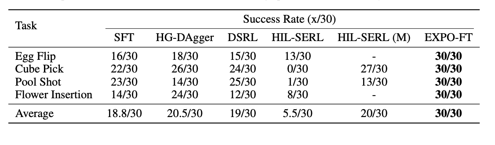 **100%** success rate (30/30) on complex tasks (e.g., string light routing, flower insertion, pool ball striking) within an average of **19.1 minutes** of online robot interaction. | `VLA`, `Online RL`, `Human-in-the-loop` | Code (Coming Soon) | <a href="https://arxiv.org/abs/2605.25477" target="_blank">Paper</a> | <a href="https://pd-perry.github.io/expo-ft/" target="_blank">Project</a> | Stanford University | Uses a lightweight residual "edit" policy ($\pi_{\text{edit}}$) to predict adjustments to a base VLA model's actions, preserving pretrained generalist priors while enabling rapid online RL and human correction. | **1.** Frozen VLA base policy providing robust generalist priors. **2.** Lightweight residual "edit" policy ($\pi_{\text{edit}}$) trained via online RL and real-time human interventions. **3.** Decoupled learner-actor setup separating heavy VLA training/inference from physical robot execution. **4.** Temporal action chunking for dynamic and precise control. |
| ARM: Advantage Reward Modeling for Long-Horizon Manipulation | 04/2026 | 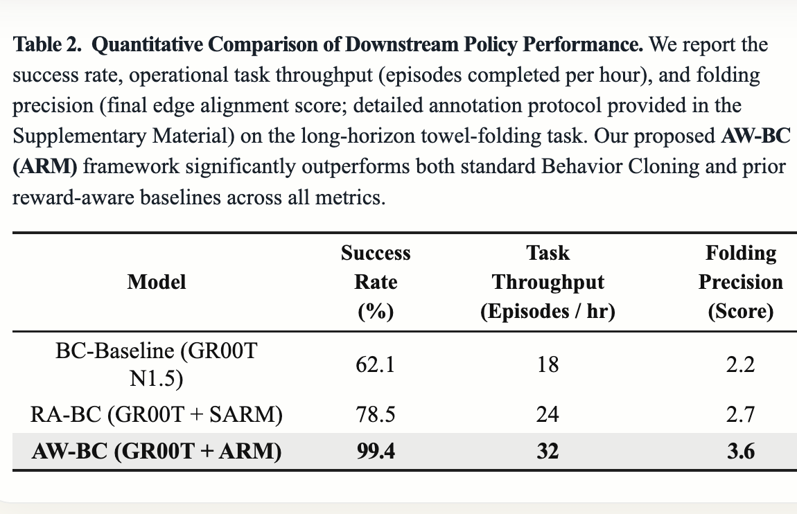**99.4%** success rate on long-horizon towel folding.  | `Rewards` | <a href="https://github.com/limxdynamics/FluxVLA" target="_blank">Code</a> | <a href="https://arxiv.org/abs/2604.03037" target="_blank">Paper</a> | <a href="https://aiming1998.github.io/ARM" target="_blank">Project</a> | LimX Dynamics | Shifts from absolute progress to estimating relative advantage (interval gain) via a lightweight tri-state labeling strategy, naturally accommodating regressive and recovery behaviors. | **1.** MIMO Temporal Advantage Transformer predicts the entire advantage sequence in a single forward pass. **2.** Advantage-Weighted Behavior Cloning adaptively reweights action chunks based on interval gains. |
| GEN-1: Scaling Embodied Foundation Models to Mastery | 04/2026 | 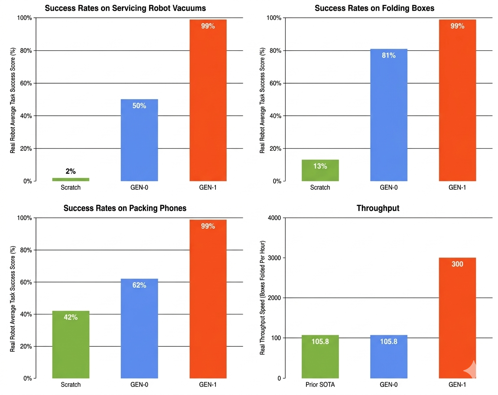 **99%** average success rate on tasks where prior models achieved 64%. Examples include folding t-shirts 86 times, folding boxes 200 times, and packing phones. Operates at ~3x the speed of prior SOTA. | `VLA`, `Foundation Models` | No Code : ( | | <a href="https://generalistai.com/blog/apr-02-2026-GEN-1" target="_blank">Article</a> | Generalist | Scaling embodied foundation models trained primarily on human data crosses the mastery threshold (reliability, speed, and improvisation) for real-world tasks, requiring only ~1 hour of robot data per task. | **1.** Large multimodal model trained from scratch on 500,000+ hours of physical interaction data from wearable devices. **2.** Task adaptation using ~1 hour of robot data via RL from experience and multimodal human guidance. **3.** Real-time inference using Harmonic Reasoning and new forms of paged attention. |
| RL Token: Bootstrapping Online RL with Vision-Language-Action Models | 03/2026 | 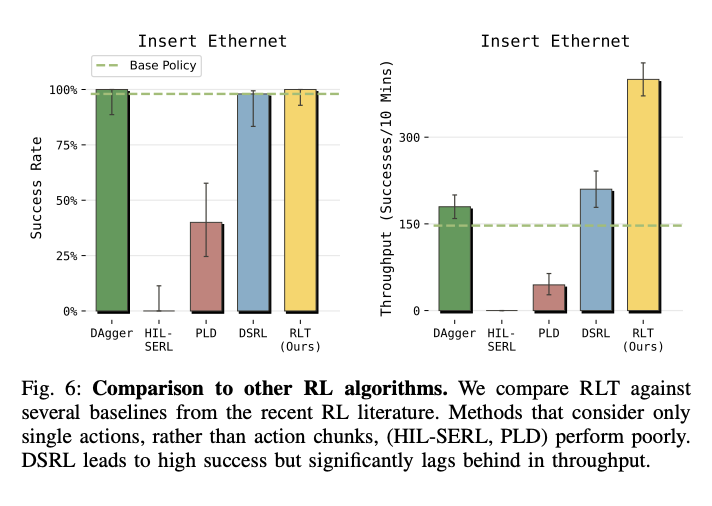 Across four challenging manipulation tasks (screwdriver, zip tie, Ethernet, charger), RLT speeds up execution by up to **3×** and substantially improves success rates (e.g., from **20% to 65%** for screw-insertion). Full-task success rates improved by **40%** on screwdriver and **60%** on zip tie. Surpasses human teleoperation speed on the Ethernet task. | `Online RL`, `VLA` | No Code : ( | <a href="https://www.pi.website/download/rlt.pdf" target="_blank">Paper</a> | <a href="https://www.pi.website/research/rlt" target="_blank">Project</a> | Physical Intelligence | Isolating a task-relevant "RL token" from VLA embeddings enables stable, real-time online RL that can surpass human teleoperation speed in under an hour of training. | **1.** Frozen VLA ($\pi_0$) base perception. **2.** Encoder-Decoder Transformer extracts compressed **RL Token** from internal VLA embeddings. **3.** Lightweight actor-critic MLP heads. **4.** Online RL fine-tunes actor-critic heads directly on robot. **5.** Learned actor residuals refine/anchor the VLA's base actions. |
| From Prior to Pro: Efficient Skill Mastery via Distribution Contractive RL Finetuning (DICE-RL) | 03/2026 | 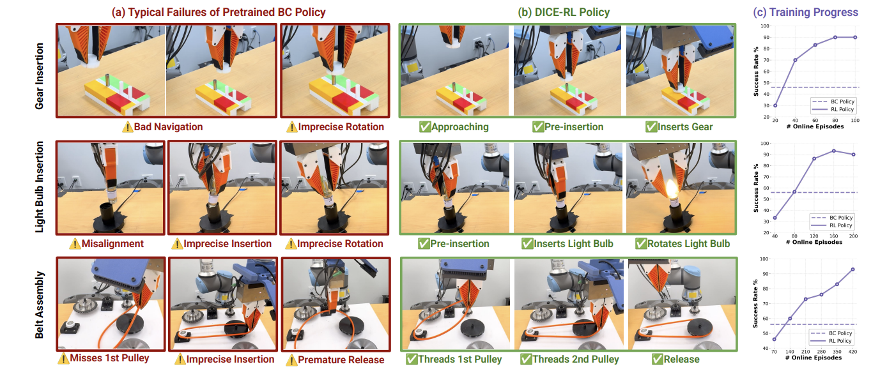 Belt Assembly: **93.3%** SR (from 56.7%), Light Bulb Insertion: **90%** SR (from 56.7%), Gear Insertion: **90%** SR (from 46.7%). | `Online RL`, `Skill Mastery` | [Sim Code](https://github.com/zhanyisun/dice-rl.git) | <a href="https://arxiv.org/abs/2603.10263" target="_blank">Paper</a> | <a href="https://zhanyisun.github.io/dice.rl.2026/" target="_blank">Project</a> | Stanford University | Treats RL as a "distribution contraction" operator that sharpens pre-trained generative policies by amplifying successful behaviors through stable, sample-efficient online feedback. | **1.** Frozen diffusion or flow-based BC prior. **2.** Lightweight residual actor-critic MLP heads. **3.** Selective behavior regularization for stable fine-tuning. **4.** Value-guided action selection to amplify high-reward behaviors. |
| DexHiL: A Human-in-the-Loop Framework for Vision-Language-Action Model Post-Training in Dexterous Manipulation | 03/2026 | 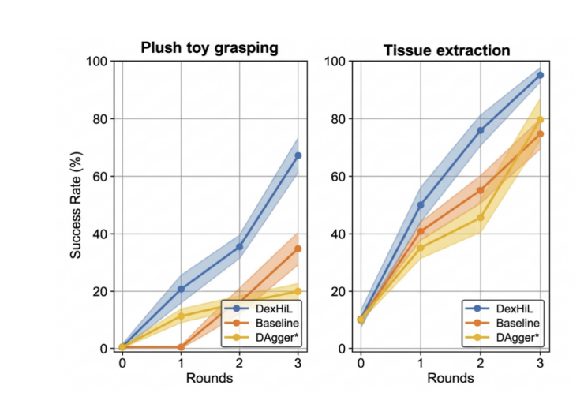 **95%** success on Tissue Extraction, **65%** on Plush Toy Grasping. Outperforms baseline by **25%** on average. | `VLA`, `Human-in-the-loop`, `Dexterous Manipulation` | No Code : ( | <a href="https://chenzhongxi-sjtu.github.io/dexhil/DexHiL-3.pdf" target="_blank">Paper</a> | <a href="https://chenzhongxi-sjtu.github.io/dexhil/" target="_blank">Project</a> | Shanghai Jiao Tong University, CASIA, Shanghai AI Laboratory | First arm-hand human-in-the-loop framework for dexterous VLAs. Features an intervention-aware sampling and weighting strategy that prioritizes corrective segments during post-training to accelerate convergence and mitigate covariate shift. | **1.** Unified arm-hand teleoperation interface for coordinated human intervention. **2.** Intervention-aware data sampling prioritizes corrective segments. **3.** Post-training pipeline combines online HiL and offline data. **4.** Weighted training mechanism emphasizes real-time expert corrections. **5.** Two-stage hand joint retargeting for precise dexterous control. |
| Contact-Anchored Policies: Contact Conditioning Creates Strong Robot Utility Models | 02/2026 | Average zero-shot success with Picking, Opening, and Closing tasks across 4 robot arms shown below. 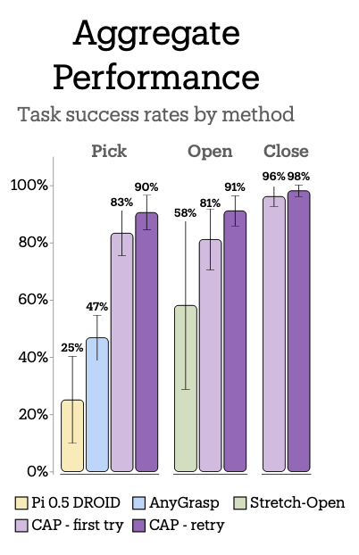 | `Representation Learning` | <a href="https://github.com/jeffacce/cap-policy" target="_blank">Code</a> | <a href="https://arxiv.org/abs/2501.05936" target="_blank">Paper</a> | <a href="https://cap-policy.github.io/" target="_blank">Project</a> | NYU, UC Berkeley, UCLA, Hello Robot, Ai2, University of Waterloo | Replaces abstract language conditioning with precise 3D "contact anchors" to guide actions, enabling robust zero-shot generalization across environments and robot embodiments with minimal data. | **1.** Modular utility models factorized by task (pick, open, close). **2.** Hindsight contact labeling identifies 3D coordinates during demonstration processing. **3.** Contact prompting during inference via manual or VLM-generated visual anchors. **4.** EgoGym simulation benchmark for rapid "real-to-sim" failure mode refinement. |
| TwinRL-VLA: Digital Twin-Driven Reinforcement Learning for Real-World Robotic Manipulation | 02/2026 | 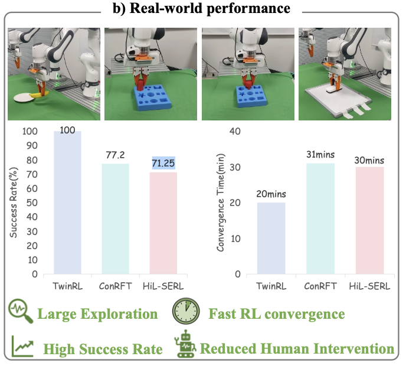 **100%** success rate across four tasks (Pick-and-Place, Insert-Hexagon-Block, Insert-Triple-Column-Block, Erase-Whiteboard). Converges in ~20 minutes with **30%** speedup over prior methods (ConRFT: 77.2%, HiL-SERL: 71.25%). | `Online RL`, `VLA`, `Digital Twin` | Code(<a href="https://github.com/jiangyurong609/twinRL-lingbot-vla" target="_blank">unofficial by Yurong Jiang</a>) | <a href="https://arxiv.org/abs/2602.09023" target="_blank">Paper</a> | <a href="https://sites.google.com/view/twinrl/twinrl" target="_blank">Project</a> | Peking University, Simplexity Robotics, Tsinghua University, HKUST | A digital twin–real-world collaborative framework that expands the exploration space in simulation to broaden the trajectory distribution and accelerate online RL via sim-to-real guidance. | **1.** High-fidelity digital twins reconstructed from smartphone-captured real-world scenes. **2.** Exploration space expansion in simulation to broaden the data distribution beyond SFT. **3.** Sim-to-real guided exploration strategy to accelerate online fine-tuning. **4.** Targeted human-in-the-loop interventions informed by failures identified in the twin. |
| RISE: Self-Improving Robot Policy with Compositional World Model | 02/2026 | 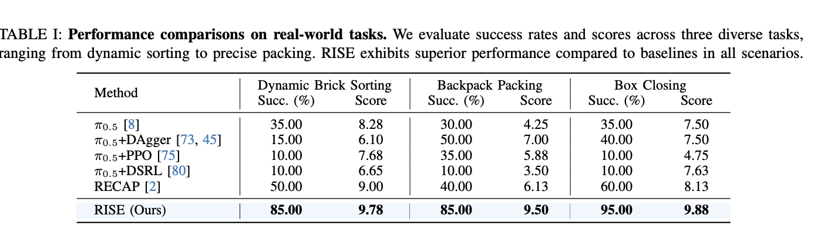 Dynamic Brick Sorting: **85%** success rate (+35% absolute improvement). Backpack Packing: **85%** success rate (+45% absolute improvement). Box Closing: **95%** success rate (+35% absolute improvement). | `Online RL`, `World Models`, `Self-Improvement` | <a href="https://github.com/OpenDriveLab/RISE" target="_blank">Code (official)</a> <a href="https://github.com/lucidrains/RISE" target="_blank">unofficial by lucidrains</a> | <a href="https://arxiv.org/pdf/2602.11075" target="_blank">Paper</a> | <a href="https://opendrivelab.com/RISE" target="_blank">Project</a> | CUHK, Kinetix AI, HKU, Tsinghua University, Horizon Robotics, Shanghai Innovation Institute | Decomposes world modeling into controllable dynamics prediction and failure-sensitive value evaluation, enabling a closed-loop self-improving pipeline via massive-scale imagined rollouts without physical environment resets. | **1.** Controllable Dynamics Model built on video diffusion to predict multi-view observations. **2.** Progress Value Model to score imagined states and provide stable advantage feedback. **3.** Rollout policy interacting with the world model to generate on-policy training data. **4.** Advantage-conditioned behavior policy optimization in the virtual space. |
| LingBot-VA: Causal World Modeling for Robot Control | 01/2026 | Real-world Success Rate (SR) / Progress Score (PS): Make Breakfast **75% SR/97% PS**, Pick Screws **70% SR/82.5% PS**, Fold Clothes **35% SR/48.8% PS**, Unpack Delivery **65% SR/84.5% PS**, Insert Tubes **40% SR/85.8% PS**, Fold Pants **70% SR/76.7% PS**. Achieves **>20%** improvement over π0.5 on challenging tasks with only 50 demos. 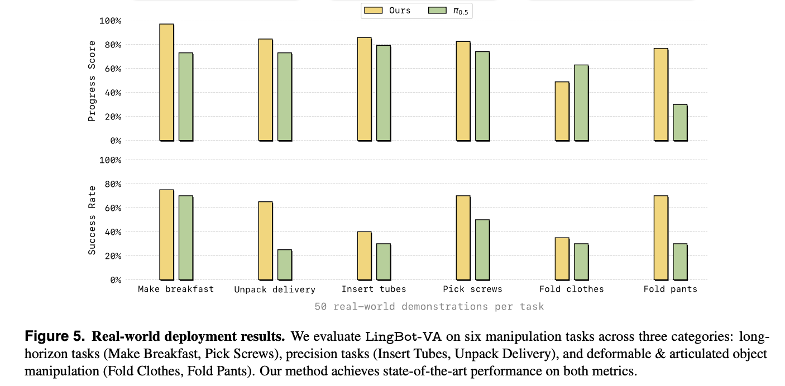 | `World Models` | <a href="https://github.com/robbyant/lingbot-va" target="_blank">Code</a> | <a href="https://github.com/Robbyant/lingbot-va/blob/main/LingBot_VA_paper.pdf" target="_blank">Paper</a> | <a href="https://technology.robbyant.com/lingbot-va" target="_blank">Project</a> | Ant Group/Alibaba | Causal world modeling framework that unifies visual dynamics and action inference by interleaving video/action tokens in a single sequence, allowing the robot to "imagine" future outcomes. | **1.** Autoregressive diffusion framework (5.3B params) using flow matching. **2.** Mixture-of-Transformers (MoT) architecture for shared latent space representation. **3.** Unified autoregressive sequence of interleaved video and action tokens. **4.** Asynchronous inference pipeline with KV Cache for real-time motor execution. |
| Cosmos Policy: Fine-Tuning Video Models for Visuomotor Control and Planning | 01/2026 | **93.6%** average success on challenging real-world ALOHA bimanual manipulation tasks. With model-based planning, achieves **12.5%** higher task completion rate on challenging real-world tasks.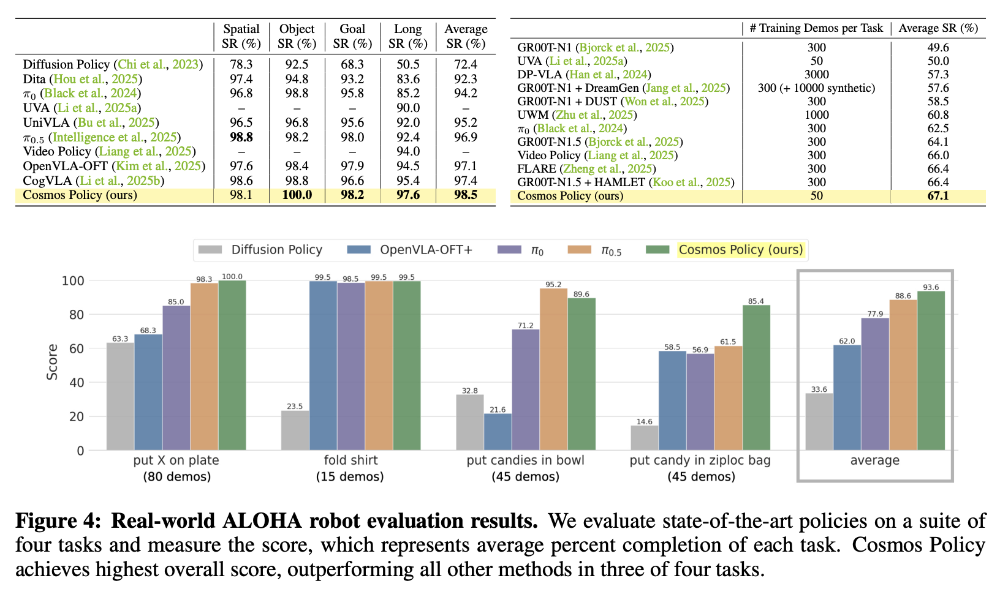 | `World Models` | <a href="https://github.com/nvlabs/cosmos-policy" target="_blank">Code</a> | <a href="https://arxiv.org/abs/2601.16163" target="_blank">Paper</a> | <a href="https://research.nvidia.com/labs/dir/cosmos-policy/" target="_blank">Project</a> | NVIDIA, Stanford University | Leverages pre-trained video diffusion models to capture physical laws, using "latent frame injection" to unify proprioception, actions, and rewards within the video generation process. | **1.** Large latent video diffusion base (Cosmos-Predict2-2B). **2.** Latent frame injection spatially broadcasts non-image data into the diffusion sequence. **3.** Unified fine-tuning for joint action, future state, and value prediction. **4.** Model-based planning via Best-of-N sampling using the internal world model. |
| Does learning from experience benefit small AI robotics models? | 12/2025 | 4/5 when training simple ACT on imitation + corrections only. | `Imitation Learning` | No Code : ( | | <a href="https://villekuosmanen.medium.com/does-learning-from-experience-benefit-small-ai-robotics-models-3de024f930e0" target="_blank">Article</a> | | Proves that even small task-specific models (like ACT) benefit significantly from RL post-training by learning to distinguish between "good" and "bad" actions, essential for recovery behaviors. | **1.** Small, high-frequency base architecture (e.g., ACT) optimized for low-latency control. **2.** RL-based post-training using advantage-guided updates. **3.** Specialization on focused tasks to avoid the data/compute burden of large VLAs. **4.** Focus on learning recovery motion speed and efficiency beyond initial BC demonstrations. |
|π*0.6 : a VLA That Learns From Experience| 11/2025 |The system ran for 13 hours straight making espresso drinks and over two hours folding novel laundry items without interruptions. Success Rates: Laundry (t-shirts & shorts) **~95%**, Laundry (Diverse Hardest Items) **~70%**, Make Espresso **~90%**, Box Assembly **~90%**  | `VLA` | No Code : ( | <a href="https://www.pi.website/download/pistar06.pdf" target="_blank">Paper</a> | <a href="https://www.pi.website/blog/pistar06" target="_blank">Project</a> | Physical Intelligence | RECAP (RL with Experience and Corrections via Advantage-conditioned Policies) enables VLAs to learn from their own successes and failures. By using an advantage value function to evaluate progress, the model extracts optimal behaviors even from suboptimal data, doubling throughput on complex tasks. | **1.** Gemma 3 4B VLM backbone with an 860M-parameter "action expert" module for high-frequency control. **2.** RECAP training loop incorporates autonomous experience and teleoperated expert corrections. **3.** Advantage-conditioned policy refinement uses a learned value function to prioritize high-reward actions. **4.** Three-stage pipeline: Offline RL pre-training → Autonomous experience collection → RECAP policy optimization. |
| RL-100: Performant Robotic Manipulation with Real-World Reinforcement Learning | 10/2025 | **100%** success across 7 tasks. **92.5%** average zero-shot success on 3 tasks (without any retraining or fine-tuning), **86.7%** average few-shot success on 3 tasks   | `Online RL` | Code(<a href="https://github.com/Starsshine21/RL100" target="_blank">unofficial by Yanjie Ze</a>) | <a href="https://arxiv.org/abs/2510.14830" target="_blank">Paper</a> | <a href="https://lei-kun.github.io/RL-100/" target="_blank">Project</a> | Shanghai Qizi, Shanghai Jiao Tong, HKU, UNC Chapel Hill | Unifies IL and RL under a single PPO-style objective within the diffusion denoising process, achieving 100% success across diverse tasks by pushing performance beyond human demonstrations. | **1.** Three-stage pipeline: IL Pre-training → Iterative Offline RL (gated by OPE) → Online RL Fine-tuning. **2.** Lightweight consistency distillation procedure to compress multi-step diffusion into a one-step controller. **3.** Self-supervised visual encoder for stable, drift-resistant representations during RL. **4.** Diffusion-based visuomotor backbone supporting single-action and action-chunking control. |
| APO: Human-assisted Robotic Policy Refinement via Action Preference Optimization | 10/2025 | Improvement on success rates of Dagger, TPO, etc on in-distribution, as well as when position, background, or texture are disrupted.   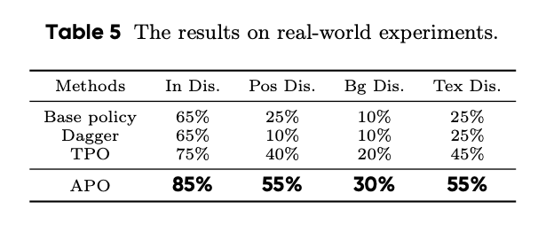 | `Human-in-the-loop` | <a href="https://github.com/GeWu-Lab/Action-Preference-Optimization" target="_blank">Code</a> | <a href="https://arxiv.org/pdf/2506.07127" target="_blank">Paper</a> | <a href="https://gewu-lab.github.io/action_preference_optimization/" target="_blank">Project</a> | ByteDance | | |
| HI-ORS: Human-in-the-loop Online Rejection Sampling for Robotic Manipulation | 10/2025 | Improved RW Success Rates vs vanilla BC, HIL-SERL, Q-Chunking. 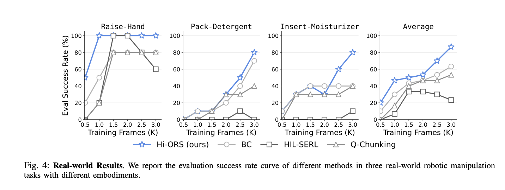 | `Human-in-the-loop` | <a href="https://github.com/hiors-project/hiors" target="_blank">Code</a> | <a href="https://arxiv.org/pdf/2510.26406" target="_blank">Paper</a> | <a href="https://hiors-project.github.io/" target="_blank">Project</a> | TenCent | | |
| ARMADA/FLOAT: Autonomous Online Failure Detection and Human Shared Control Empower Scalable Real-world Deployment and Adaptation | 10/2025 | failure detector FLOAT achieves nearly **95%** accuracy on average, surpassing prior SOTA failure detection approaches by > 20%. 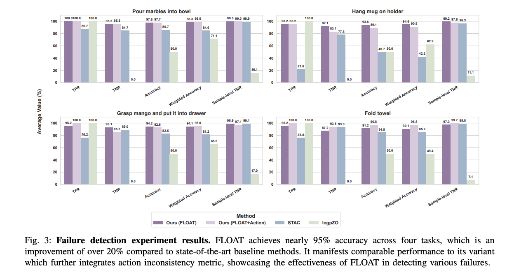 | | <a href="https://github.com/Virlus/armada" target="_blank">Code</a> | <a href="https://arxiv.org/abs/2510.02298" target="_blank">Paper</a> | <a href="https://virlus.github.io/armada/" target="_blank">Project</a> | Shanghai Jiao Tong University | | |
| SELF-IMPROVING VISION-LANGUAGE-ACTION MODELS WITH DATA GENERATION VIA RESIDUAL RL (PLD) | 10/2025 | 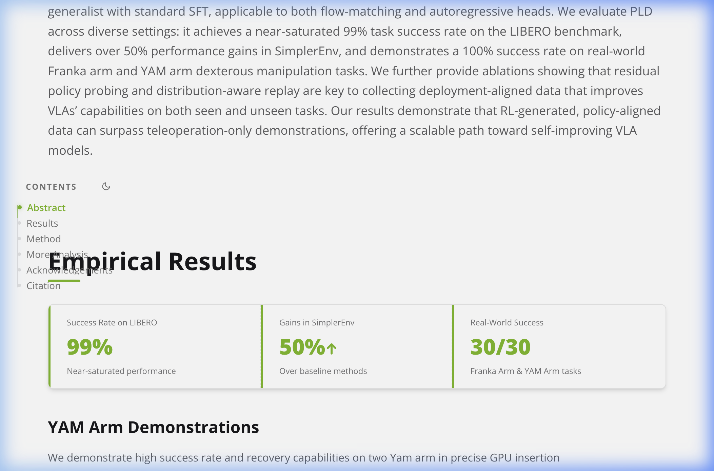 **100%** real-world success (30/30) on Franka and YAM arm dexterous manipulation tasks. 99% on LIBERO. | `VLA`, `Online RL`, `Residual RL` | No Code : ( | <a href="https://wenlixiao.com/self-improve-VLA-PLD/assets/doc/pld-fullpaper.pdf" target="_blank">Paper</a> | <a href="https://wenlixiao.com/self-improve-VLA-PLD/" target="_blank">Project</a> | NVIDIA, CMU, UC Berkeley, UT Austin | Improves VLA reliability by training specialist residual actors via RL to handle failure regions, then distilling these successful/recovery trajectories back into the VLA generalist via SFT. | **1.** Frozen VLA backbone with task-specific residual policy "heads" trained via off-policy RL. **2.** Hybrid rollout scheme for data collection. **3.** Multi-task SFT distillation to improve the base VLA. |
| SARM: Stage-Aware Reward Modeling for Long Horizon Robot Manipulation | 09/2025 | **83%** success on folding T-shirts (flattened), **67%** success on folding T-shirts (crumpled). Surpasses vanilla BC (8% and 0%). | `Rewards` | Code ([lerobot](https://huggingface.co/docs/lerobot/sarm)) | <a href="https://arxiv.org/abs/2509.25358" target="_blank">Paper</a> | <a href="https://qianzhong-chen.github.io/sarm.github.io/" target="_blank">Project</a> | Stanford, UC Berkeley, xdof.ai | Provides stable, grounded progress signals for long-horizon tasks by jointly predicting discrete task stages and fine-grained progress, avoiding brittle frame-index-based rewards. | **1.** Dual-head transformer architecture (Stage Estimator + Subtask Estimator) with a shared multimodal backbone. **2.** Processes multimodal sequences (CLIP + proprioception) to capture temporal task dependencies. **3.** Derives rewards from natural language subtask annotations for consistent progress estimation. **4.** Integrated with Reward-Aligned Behavior Cloning (RA-BC) for high-precision deformable manipulation. |
| Dual-Actor Fine-Tuning of VLA Models: A Talk-and-Tweak Human-in-the-Loop Approach | 09/2025 | **100%** success across three tasks within 101 minutes of online fine-tuning. For long-horizon tasks, it sustains a **50%** success rate over 12 consecutive operations.  | `VLA` | No Code : ( | <a href="https://arxiv.org/pdf/2509.13774" target="_blank">Paper</a> | <a href="https://sites.google.com/view/hil-daft/" target="_blank">Project</a> | Zhejiang & others | Introduces a "talk-and-tweak" scheme that translates physical human corrections into semantically grounded language commands, enabling efficient and interpretable policy adjustments. | **1.** Dual-actor system: Primary Actor for multi-task base actions + Refinement Actor for fine-grained adjustments. **2.** Refinement Actor operates in the policy's latent noise space, guided by natural-language refinement commands. **3.** "Talk-and-Tweak" interface converts real-time tweaks into semantic "talk" instructions. **4.** RL-based adaptation loop updates the refinement actor to align with human expert corrections. |
| WSRL: Efficient Online Reinforcement Learning Fine-Tuning Need Not Retain Offline Data | 07/2025 | **100%** success rate on Franka peg insertion task in 18 minutes, SERL fails (0/20) even with 50 minutes.  | `Online RL` | <a href="https://github.com/zhouzypaul/wsrl" target="_blank">Code</a> | <a href="https://arxiv.org/pdf/2412.07762" target="_blank">Paper</a> | <a href="https://zhouzypaul.github.io/wsrl/" target="_blank">Project</a> | UC Berkeley | Demonstrates that retaining offline data during fine-tuning is unnecessary if a "warm-start" phase is used to recalibrate the Q-function, preventing catastrophic forgetting while significantly reducing computational costs. | **1.** Policy and value function initialization via offline RL pre-training. **2.** Warmup phase collects online rollouts using the *frozen* offline policy. **3.** Recalibration of the offline Q-function to the online distribution during warmup. **4.** Standard online RL fine-tuning with high update-to-data ratios for accelerated learning. |
| Dyna Robotics | 07/2025 | **99.9%** success rate in folding towels for 8 hours/day over 3 days (dropped 1 towel on day 2). No intervention. | | No Code : ( | | <a href="https://x.com/DynaRobotics/status/1940443709621109186" target="_blank">Project</a> | Dyna Robotics | | |
| Figure (Helix) | 06/2025 | **~95%** accuracy at correctly orienting barcodes. **4.05** seconds per package. | | No Code : ( | | <a href="https://www.figure.ai/news/scaling-helix-logistics" target="_blank">Project</a> | Figure | Adds memory for more robust, long-term tasks and force feedback for improved grip. | |
| RSS 2025 Workshop: Human-in-the-Loop Robot Learning: Teaching, Correcting, and Adapting | 06/2025 | various results | | No Code : ( | | <a href="https://hitl-robot-learning.github.io/" target="_blank">Project</a> | various universities | | |
| Compliant Residual DAgger: Improving Real-World Contact-Rich Manipulation with Human Corrections | 06/2025 | book-flipping success rate of **100%** (**60%** improvement) and belt assembly success of **70%** (**50%** improvement)   | `Human-in-the-loop` | <a href="https://github.com/yifan-hou/cr-dagger" target="_blank">Code</a>| <a href="https://arxiv.org/abs/2506.16685" target="_blank">Paper</a> | <a href="https://compliant-residual-dagger.github.io/" target="_blank">Project</a> | Stanford | | |
| ReWiND: Language-Guided Rewards Teach Robot Policies without New Demonstrations | 05/2025 | an hour of real-world RL improves success rate from 12% to 68%, vs 8% to 10% with VLC   | `Rewards` | <a href="https://github.com/rewind-reward/ReWiND" target="_blank">Code</a> | <a href="https://arxiv.org/abs/2505.10911" target="_blank">Paper</a> | <a href="https://rewind-reward.github.io/" target="_blank">Project</a> | U Wash | | |
| Dyna Robotics DYNA-1 Model | 04/2025 | **99.4%** success rate in folding napkins over 24 hours. No intervention. &nbsp;&nbsp;&nbsp;&nbsp;&nbsp;&nbsp;&nbsp;&nbsp;&nbsp;&nbsp;&nbsp;&nbsp;&nbsp;&nbsp;&nbsp;&nbsp;&nbsp;&nbsp;&nbsp;&nbsp;&nbsp;&nbsp;&nbsp;&nbsp;&nbsp;&nbsp;&nbsp;&nbsp;&nbsp;&nbsp;&nbsp;&nbsp;&nbsp;&nbsp;&nbsp;&nbsp;&nbsp;&nbsp;&nbsp;&nbsp;&nbsp;&nbsp;&nbsp;&nbsp;&nbsp;&nbsp;&nbsp;&nbsp;&nbsp;&nbsp;&nbsp;&nbsp;&nbsp;&nbsp;&nbsp;&nbsp;&nbsp;&nbsp;&nbsp;&nbsp;&nbsp;&nbsp;&nbsp;&nbsp;&nbsp;&nbsp;&nbsp;&nbsp;&nbsp;&nbsp;&nbsp;&nbsp;&nbsp;&nbsp;&nbsp;&nbsp;&nbsp;&nbsp;&nbsp;&nbsp;&nbsp;&nbsp;&nbsp;&nbsp;&nbsp;&nbsp;&nbsp;&nbsp;&nbsp;&nbsp;&nbsp;&nbsp;&nbsp;&nbsp;&nbsp;&nbsp;&nbsp;&nbsp;&nbsp;&nbsp;&nbsp;&nbsp; | | No Code : ( | | <a href="https://www.dyna.co/research)" target="_blank">Project</a> | Dyna Robotics | | |
| ConRFT: A Reinforced Fine-tuning Method for VLA Models via Consistency Policy | 02/2025 | **96.3%** avg success rate across tasks, compared to 31.9% w/ HIL-SERL  | `VLA` | <a href="https://github.com/cccedric/conrft" target="_blank">Code</a> | <a href="https://arxiv.org/pdf/2502.05450" target="_blank">Paper</a> | | Chinese Academy of Sciences | Integrates RL with consistency distillation to simultaneously boost VLA reliability and inference speed, enabling single-step action generation that is 5-10x faster than iterative diffusion. | **1.** Offline Calibrated Q-Learning (Cal-QL) stabilizes value estimation on small demo sets. **2.** Human-in-the-loop online RL (HIL-ConRFT) enables rapid real-world adaptation. **3.** Unified consistency-based training objective used across both offline and online stages. **4.** Consistency distillation transforms iterative diffusion into high-frequency, single-step inference. |
| HIL-SERL: Precise and Dexterous Robotic Manipulation via Human-in-the-Loop Reinforcement Learning | 10/2024 | **100%** success rate on a variety of tasks  | `Online RL` | Code(<a href="https://github.com/rail-berkeley/hil-serl" target="_blank">official</a>, (<a href="https://github.com/ggggfff1/hil-serl-sim" target="_blank">sim</a>, <a href="https://huggingface.co/docs/lerobot/en/hilserl" target="_blank">lerobot</a>) | <a href="https://hil-serl.github.io/static/hil-serl-paper.pdf" target="_blank">Paper</a> | <a href="https://hil-serl.github.io/" target="_blank">Project</a> | UC Berkeley | Integrates real-time human corrections with sample-efficient RL to master complex, vision-based manipulation directly in the real world, achieving 100% success on diverse tasks in under 3 hours of training. | **1.** Asynchronous Actor, Learner, and Replay Buffer processes. **2.** Real-time human intervention via SpaceMouse for reactive corrections during exploration. **3.** Learned binary reward classifier trained on teleoperated positive/negative samples. **4.** Off-policy RL (SAC) optimized for high-frequency real-world interaction. |
| RLIF: INTERACTIVE IMITATION LEARNING AS REINFORCEMENT LEARNING | 03/2024 | **95%** success rate in cloth unfolding within 7 rounds, **100%** rate success in peg insertion within 6 rounds  | `Imitation Learning` | <a href="https://github.com/pd-perry/RLIF" target="_blank">Code</a> | <a href="https://arxiv.org/pdf/2311.12996" target="_blank">Paper</a> | <a href="https://rlif-page.github.io/" target="_blank">Project</a> | UC Berkeley | | |
| SERL: A Software Suite for Sample-Efficient Robotic Reinforcement Learning | 01/2024 | **100%** success on PCB insertion, cable routing, object relocation  | `Online RL` | <a href="https://github.com/rail-berkeley/serl" target="_blank">Code</a> | <a href="https://arxiv.org/abs/2401.16013" target="_blank">Paper</a> | <a href="https://serl-robot.github.io/" target="_blank">Project</a> | UC Berkeley | | |